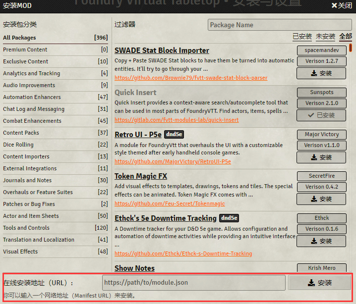

# DND5e classpack for fvtt

整合了大部分种族，职业，物品，法术，同时可以使dm完全关闭babele换取加载性能。  
该mod与babele兼容性很差，请自行决定是否开启babele。

使用方法：  
打开安装MOD界面，复制以下路径

    https://raw.githubusercontent.com/HJSmile/classpack/master/dnd5e_classpack/module.json

粘贴至以下位置后，点击安装

